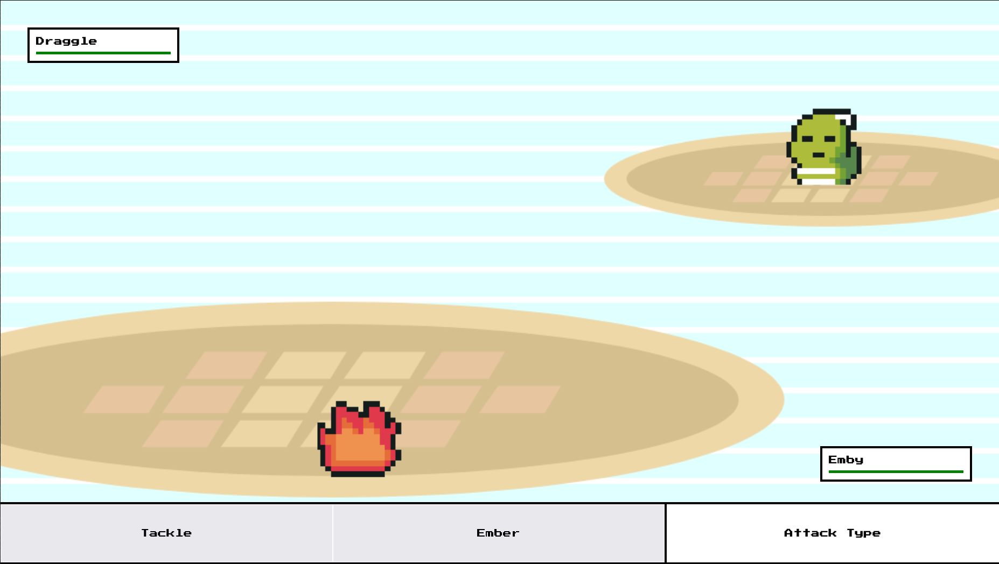

# IslandAdventure

A pokemon-esque style game.

A breath of fresh air while staying hopeful on future employment. While this isnt using the latest framework, or any catchy buzzwords, its great vanilla practice and has been a ton of fun.
 
Tiled (program to make the map image) is an absolute treat, and extraordinarily easy to use.

## Want to play?

You can try a demo <a href="https://jamesonarnett.github.io/IslandAdventure/">here</a> as I continue
development.

## Progress Pics

